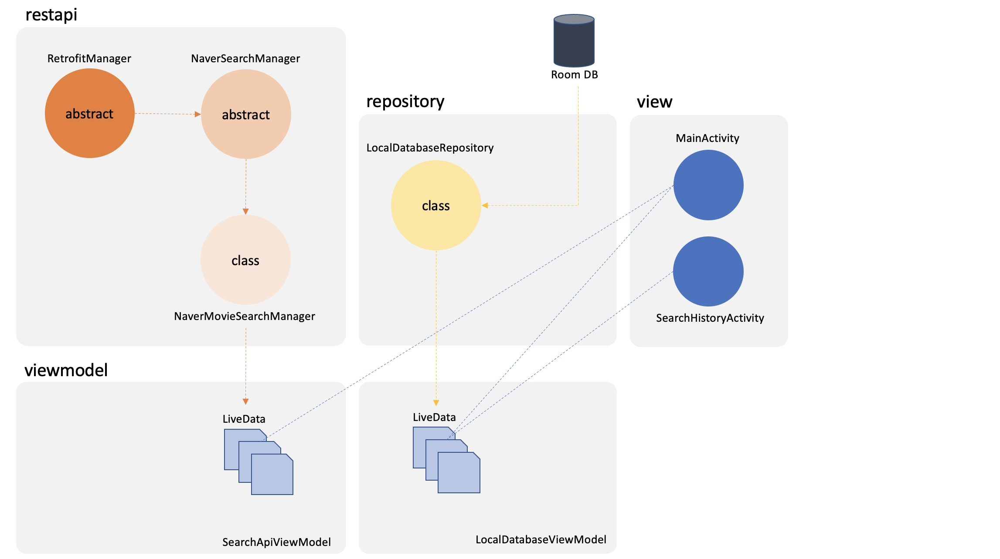

# NaverSearchApi-MovieSearch

### 개인 프로젝트
### 개발 기간: 2022. 04. 22 ~ 2022. 05. 12

&nbsp;

## 목차
[프로젝트 개요](#프로젝트-개요)  
[기능](#기능)  
[미리보기](#미리보기)  
[아키텍쳐](#아키텍쳐)  
[주요 기술 스택](#주요-기술-스택)  
[주요 구현 기능](#주요-구현-기능)  
[API Version Test](#api-version-test)

---
## 프로젝트 개요
* 네이버 검색 API를 이용하여 영화 검색 및 검색 이력 저장을 구현한 애플리케이션입니다.
* REST API 활용 외에도 Room Database를 이용한 검색 이력 저장에 대한 내용도 포함되어 있습니다.
* 이 프로젝트를 제작하기 위해서 [REST API 개념 및 Retrofit 실습](https://github.com/imJuhyg/restapi-study)에 대한 내용도 정리했습니다.
---
## 기능
1. 네이버 영화를 검색할 수 있습니다.
2. 검색한 영화를 클릭하면 네이버 영화 정보 페이지로 이동합니다.
3. 검색 이력이 저장됩니다. 최근에 검색한 이력을 10개까지만 표시합니다.
4. 검색 이력이 포함된 TextView를 누르면 해당 검색명을 통해 다시 검색합니다.
---

## 미리보기


---

## 주요 기술 스택
### Language
* ### Kotlin
### Android
* ### Retrofit2 - 네이버 영화 검색 API 호출
* ### Glide - 영화 썸네일 이미지 로딩
* ### Room Database - 최근 검색 이력 저장을 위한 로컬 데이터베이스
* ### Coroutines - 네트워킹을 위한 비동기 처리

---

## 아키텍쳐
### MVVM  

  
---
## 주요 구현 기능
### 1. 재사용성을 고려한 클래스 확장
* RetrofitManager는 레트로핏 객체를 제공하는 추상 클래스입니다. Open API를 사용하는 여러 클래스에서 상속받을 수 있습니다.
* NaverSearchManager는 네이버 검색 API의 모든 검색 타입을 사용할 수 있도록 확장성을 높인 추상 클래스입니다.  
  Naver 검색 API만을 위한 추상 클래스이며, 다음의 기능을 수행할 수 있습니다.  
```
1. CLIENT_ID 및 CLIENT_SECRET 값을 정의할 수 있습니다.
2. 제네릭으로 구현된 추상 클래스입니다. 제네릭 타입 T를 통해 여러 가지 DTO타입을 외부에서 지정할 수 있습니다.
   ex) MovieDTO, NewsDTO, BookDTO, ...
3. 검색을 요청하는 메소드는 추상 메소드로 구현되어 상속받아 오버라이딩할 수 있습니다.
4. 다음 검색의 시작 위치를 반환하는 일반 메소드를 사용할 수 있습니다.
```
  
#### RetrofitManager
```kotlin
abstract class RetrofitManager(private val baseUrl: String) {
  fun getRetrofit(): Retrofit {
    return Retrofit.Builder()
      .baseUrl(baseUrl)
      .addConverterFactory(GsonConverterFactory.create())
      .build()
  }
}
```
  
#### NaverSearchManager
```kotlin
abstract class NaverSearchManager<T: Any> : RetrofitManager(NAVER_SEARCH_API_URL) {
  // T: 결과로 받을 DTO 객체 타입을 명시. ex) MovieDTO, BookDTO, newsDTO...

  protected val CLIENT_ID = "U3EGn6EooBj0_Kkc5iJU"
  protected val CLIENT_SECRET = "ZUVF06lS3m"

  companion object {
    private const val NAVER_SEARCH_API_URL = "https://openapi.naver.com/v1/"
  }

  /** 검색 요청 메소드
    * startIndex: 검색 시작 위치이며 기본값은 1입니다. 첫 검색은 기본값으로 제공하고, 
    * 다음 검색을 요청하고 싶은 경우 다음 검색의 시작위치를 넣으면 됩니다.
    * searchQuery: 검색을 원하는 문자열입니다.
    * onSuccess: 검색에 성공했을 때 콜백입니다. 결과가 리스트형태로 제공되고 다음 검색의 시작 위치가 제공됩니다.
    * onFailure: 요청에는 성공했지만, 에러 코드가 발생한 경우입니다. 에러 코드를 콜백합니다.
    * onError: 요청 자체를 실패한 경우입니다. 요청한 서버에 장애가 발생했거나, 개발자의 잘못된 코드가 원인일 수도 있습니다.
    */
  abstract fun searchInfo(startIndex: Int,
                          searchQuery: String,
                          onSuccess: (resultList: List<T>, nextIndex: Int) -> Unit,
                          onFailure: (errorCode: Int) -> Unit,
                          onError: (throwable: Throwable) -> Unit)


  /** 다음 검색의 시작 위치를 구하는 메소드
    * 요청의 결과로 받은 start, display, total 값을 인자로 넣으면 다음 검색의 시작 위치를 반환합니다.
    */
  fun getNextIndex(start: Int, display: Int, total: Int): Int = if(start + display <= total) {
    start+display
  } else -1
}
```

&nbsp;

### 2. 영화 검색 API 구현
* 호출할 URL를 구성하고 Call.enqueue()를 통한 비동기 호출을 수행합니다.
* 호출 결과에 따라 onSuccess, onFailure, onError 중 하나를 콜백합니다.
```
onSuccess
결과값 호출에 성공한 경우에 콜백합니다. 결과값에는 DTO 객체가 담긴 List와 다음 검색의 시작 위치 nextIndex가 담겨있습니다.

onFailure
호출에는 성공했지만, 에러 코드를 반환한 경우에 콜백합니다. 결과값에는 errorCode가 담겨있습니다.

onError
호출에 실패한 경우입니다. 네트워크 문제 등으로 인해 발생할 수 있습니다. 결과값에는 Throwable이 담겨있습니다.
```
  
#### NaverMovieSearchManager
```kotlin
class NaverMovieSearchManager : NaverSearchManager<MovieDTO>() {
  private val movieSearchApi = getRetrofit().create(NaverMovieSearchApi::class.java)

  // 영화 검색 API
  override fun searchInfo(
    startIndex: Int,
    searchQuery: String,
    onSuccess: (resultList: List<MovieDTO>, nextIndex: Int) -> Unit,
    onFailure: (errorCode: Int) -> Unit,
    onError: (throwable: Throwable) -> Unit
  ) {

    // 호출할 URL 구성
    val call = movieSearchApi.searchData(
      CLIENT_ID,
      CLIENT_SECRET,
      "movie.json",
      searchQuery,
      startIndex
    ) // url ex) https://openapi.naver.com/v1/movie.json?query={searchWord}&startIndex={startIndex}

    call.enqueue(object: Callback<MovieItems> { // 비동기 호출
      override fun onResponse(call: Call<MovieItems>, response: Response<MovieItems>) {
        when {
          response.isSuccessful -> {
            val results = response.body()!!

            // 다음 인덱스 구하기
            val nextIndex = getNextIndex(results.start, results.display, results.total)

            for(movieDTO in results.items) {
                movieDTO.title = movieDTO.title.replace("&amp;", "&") // '&amp;'로 출력되는 결과 -> '&'으로 변경
                movieDTO.title = movieDTO.title.replace("(<b>|</b>)".toRegex(), "") // 불필요한 태그 삭제
            }
            onSuccess(results.items, nextIndex) // Callback List<MovieDTO>, nextIndex
          }

          // 응답에는 성공했지만 에러 코드인 경우
          response.code() == 400 -> { // 잘못된 검색어 입력
            onFailure(400)
          }

          response.code() == 500 -> { // 네이버 Open API 서버 에러
            onFailure(500)
          }
        }
      }

      override fun onFailure(call: Call<MovieItems>, throwable: Throwable) { // 네트워크 에러
        onError(throwable)
      }
    })
  }
}
```

&nbsp;

#### SearchApiViewModel 클래스를 통해 검색 결과를 요청하고 MainActivity에서 결과를 표시할 수 있습니다.
#### MainActivity
```kotlin
binding.searchButton.setOnClickListener { // '검색' 버튼을 클릭했을 때
  movieRecyclerViewAdapter.clearItem()
  keyboard.hideSoftInputFromWindow(binding.searchEditText.windowToken, 0) // 키보드 숨기기

  if(binding.searchEditText.text.isEmpty()) {
    Toast.makeText(this, "최소 한 자 이상의 검색어를 입력해 주세요.", Toast.LENGTH_SHORT).show()

  } else { // EditText 에 글자가 입력된 경우
    searchedWord = binding.searchEditText.text.toString()
    insertSearchHistory(searchedWord) // 검색 이력 저장

    // 검색 결과 호출(rest api)
    searchApiViewModel.searchMovie(searchQuery = searchedWord)
  }
}
```
#### 리사이클러뷰의 스크롤을 끝까지 내릴 경우 다음 검색 위치부터 다시 검색을 시작합니다.
```kotlin
// 리사이클러뷰 스크롤을 마지막까지 내렸을 때 검색 결과 추가
binding.recyclerViewMovie.addOnScrollListener(object: RecyclerView.OnScrollListener() {
  override fun onScrolled(recyclerView: RecyclerView, dx: Int, dy: Int) {
    super.onScrolled(recyclerView, dx, dy)

    val linearLayoutManager: LinearLayoutManager = recyclerView.layoutManager as LinearLayoutManager
    // 리사이클러뷰에 보여지고 있는 마지막 아이템의 position
    val lastVisibleItemPosition = linearLayoutManager.findLastCompletelyVisibleItemPosition()
    val totalItemCount = linearLayoutManager.itemCount // 전체 아이템 개수

    // 최소 한 개 이상의 아이템이 있고, 마지막 아이템을 보고 있는 경우
    if(totalItemCount != 0 && lastVisibleItemPosition == totalItemCount-1) {
      // 결과가 더 있는 경우에만 API call
      if(nextIndex > 0) searchApiViewModel.searchMovie(startIndex = nextIndex, searchQuery = searchedWord)
      else Toast.makeText(this@MainActivity, "마지막 결과입니다.", Toast.LENGTH_SHORT).show()
    }
  }
})
```

&nbsp;

#### 구현 결과


&nbsp;

### 3. 검색 이력 저장
* 검색 이력 저장을 위해 내부 저장소인 Room Database를 사용했습니다.
* 뷰에는 가장 최근에 검색한 이력 10개만 표시합니다.
* MainActivity에서 검색을 수행하면 이력이 저장되고 SearchHistoryActivity에서 검색 이력을 불러옵니다.
  
#### 테이블 설계
#### SearchHistory
|Field|Type|Null|Pri|Ex|
|---|---|---|---|---|
|id|Int|NotNull|Pri|순번(auto increment)|
|dateTime|Date|NotNull||시간 기준 내림차순 정렬을 위한 필드|
|searchWord|String|NotNull||검색어|

#### 쿼리
* dateTime 기준 내림차순 정렬/ limit으로 검색 결과 개수 제한
* 동일한 검색 기록이 있을 때 가장 최근에 검색된 검색 기록 한개만 가져옵니다.
```kotlin
// (1)-1 동일한 'searchWord'가 있을 경우 MAX(time)인 이력만 조건식 통과
// (1)-2 동일한 'searchWord'가 없으면 자기 자신이 MAX(time)이므로 조건식 통과
// (2) 최종 정렬 기준: time 내림차순
@Query("SELECT searchWord FROM SearchHistory " +
       "WHERE dateTime IN (SELECT MAX(dateTime) FROM SearchHistory GROUP BY searchWord) " + // (1)
       "ORDER BY dateTime DESC " + // (2)
       "LIMIT :limit")
fun getSearchHistory(limit: Int): List<SearchHistory>
```

&nbsp;

#### 구현 결과


&nbsp;

---

## API Version Test
* <b>api 22 - 정상 작동</b>
* <b>api 23 - 정상 작동</b>
* <b>api 24 - 정상 작동</b>
* <b>api 25 - 정상 작동</b>
* <b>api 26 - 정상 작동</b>
* <b>api 27 - 정상 작동</b>
* <b>api 28 - 정상 작동</b>
* <b>api 29 - 정상 작동</b>
* <b>api 30 - 정상 작동</b>
* <b>api 31 - 정상 작동</b>
---
